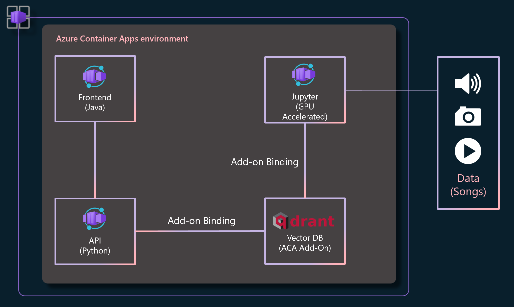

# Music Recommendation Service



## Introduction & Overview
This application is a music recommendation service, users are able to search and select from a set of songs and the system will recommend similar songs to them. The application is composed of four different components:

* A [Jupyter notebook](./notebooks/README.md) which teaches about and produces embeddings for our library of songs.
* A vector database (Qdrant) which stores the embeddings and produces our recommendations.
* A [backend](./backend/README.md) which brokers the data between the UI and the vector database.
* A [frontend](./frontend/README.md) which provides the user-facing UI to interact with the recommendation service.

The overall intention of this application is for the user to learn about vector databases. Hence the process of deploying this application is broken up into two parts. 

In part one we play the role of a data scientist or ML engineer. We will familiarize ourselves with the process of generating embeddings for our song data. This part completes when we've stored our embeddings in our vector database. 
In part two we play the role of an application engineer and turn the stored embeddings data into a recommendation service by adding a backend and frontend.

For anyone not interested in building a complete user-facing application there's an optional part in the notebook which shows recommendation retrieval without the use of the backend and frontend. The song data used in this example is based on the [Ludwig Music Dataset](https://www.kaggle.com/datasets/jorgeruizdev/ludwig-music-dataset-moods-and-subgenres) which consists of ~11k songs and has a size of roughly 5GB.


## Quickstart
If your interest is solely to learn about vector databases, and how they can be used to build cool things more quickly, simply focus on the Jupyter notebook. Refer to the official [Azure Container Apps Qdrant Tutorial](https://learn.microsoft.com/en-us/azure/container-apps/add-ons-qdrant) for detailed instructions on setting it up, and in-notebook documentation for detailed execution instructions.


## Build and Deployment

### Prerequisites
Before we begin, you will need the following:
* An Azure account and the Azure CLI tool installed
* Docker installed on your local machine
* A terminal capable of running Bash


### Building

#### Data Prep
The notebook and backend require some additional data prep prior to building any Docker containers. In the case of the backend the preparation consists of a simple [download and extraction](./backend/README.md#data-prep). For the [notebook the preparation](./notebooks/README.md#data-prep) is more involved, and it is hence recommended to simply rely on the pre-build container. Since it's not intended to be part of the running service once the embeddings have been generated, there are few reasons to build the image from scratch.

#### Docker Image Builds
Once the above data prep has been completed we can build the images:
```
# which registry to push to
export REGISTRY=yourregistry.azurecr.io

# build and push the backend image
export BACKEND_IMAGE=aca-music-recommendation-backend
cd backend
docker build -t $BACKEND_IMAGE .
docker tag $BACKEND_IMAGE $REGISTRY/$BACKEND_IMAGE
docker push $REGISTRY/$BACKEND_IMAGE

# build and push the frontend image
export FRONTEND_IMAGE=aca-music-recommendation-frontend
cd frontend
docker build -t $FRONTEND_IMAGE .
docker tag $FRONTEND_IMAGE $REGISTRY/$FRONTEND_IMAGE
docker push $REGISTRY/$BACKEND_IMAGE
```

### Deployment
These instructions are designed to deploy this service on [Azure Container Apps](https://learn.microsoft.com/en-us/azure/container-apps/overview). In order to speed up the embedding generation, we will utilize a GPU workload profile, which will be used during the initial embedding creation. The Qdrant vector database Add-on will be used as the backend for our recommendations.

1. Define Needed Variables
    ```
    export LOCATION=westus3
    export RG=music-rec-service
    export ACA_ENV=music-env
    export NOTEBOOK_IMAGE=simonj.azurecr.io/aca-music-recommendation-notebook
    export BACKEND_IMAGE=simonj.azurecr.io/aca-music-recommendation-backend
    export FRONTEND_IMAGE=simonj.azurecr.io/aca-music-recommendation-frontend
    ```

2. Create Azure Container Apps Environment
Please note that this environment create command creates a GPU workload profile (`--enable-dedicated-gpu`). If you don't have GPU quota or don't mind waiting for your embeddings to be created you can drop this argument from the command below.
    ```
    az containerapp env create \
      --name $ACA_ENV \
      --resource-group $RG \
      --location $LOCATION \
      --enable-dedicated-gpu
    ```

3. Create the Qdrant Vector DB Add-on
    ```
    az containerapp add-on qdrant create \
      --environment $ACA_ENV \
      --resource-group $RG \
      --name qdrant
    ```

4. Create the Notebook Application
Create the application and deploy the notebook image. Also enable ingress so we can connect to the application from our workstation.
    ```
    az containerapp create \
      --name music-jupyter \
      --resource-group $RG \
      --environment $ACA_ENV \
      --image $NOTEBOOK_IMAGE \
      --min-replicas 1 \
      --max-replicas 1 \
      --target-port 8888 \
      --ingress external \
      --bind qdrant \
      --workload-profile-name gpu  # drop this argument if you're not using GPU

    # once running (wait for 1-2 minutes) retrieve the login token from the log
    az containerapp logs show \
      -g $RG \
      -n $music-jupyer | grep token
    ```

5. Create the Backend and Frontend Applications
Once we have the embeddings generated we can create the backend and frontend applications.
    ```
    # backend
    az containerapp create \
      --name music-backend \
      --resource-group $RG \
      --environment $ACA_ENV \
      --image $BACKEND_IMAGE \
      --cpu 1 --memory 2.0Gi
      --min-replicas 1 \
      --max-replicas 1 \
      --target-port 8000 \
      --ingress internal \
      --exposed-port 8000 \
      --transport tcp \
      --bind qdrant

    # frontend
    az containerapp create \
      --name music-frontend \
      --resource-group $RG \
      --environment $ACA_ENV \
      --image $FRONTEND_IMAGE \
      --cpu 1 --memory 2.0Gi \
      --min-replicas 1 \
      --max-replicas 1 \
      --ingress external \
      --target-port 8080 
    ```
Given all applications were deployed successfully the application should now be accessible at the URL shown after the frontend command completes.

## Issues and Contributions
For questions or problems with this code please file issues in this repository. Contributions are welcome.

## Todo
The following items would improve this tutorial/sample:
* Develop a AZD template for easier/quicker deployment.