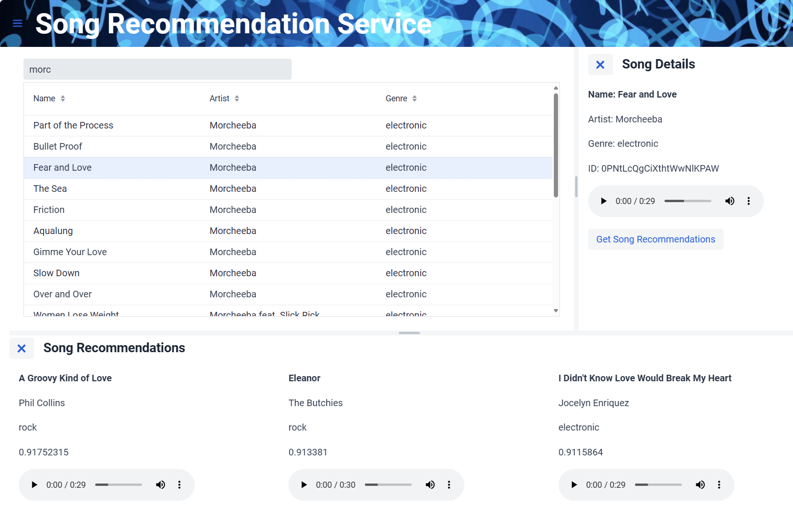

# Music Recommendation Frontend



## Overview
This frontend is part of a larger application, please see [Music Recommendation Service](../README.md) for full details. The frontend was built using Java and [Vaadin](https://vaadin.com/), it provides a basic GUI for the music recommendation service. The frontend is based on the [`vaadin/vaadin-rest-example`](https://github.com/vaadin/vaadin-rest-example). The frontend depends on the [backend](../backend/README.md) and currently the backend in hardcoded in `\src\main\java\com\vaadin\example\rest\util\Utils.java`. 

## Build and Run
To run and build the application locally please ensure you have Java version 17+ along with Maven installed then follow these steps:

### Building
The steps below will generate a complete and ready to run JAR file.
```
# ensure your JAVA_HOME is set
echo $JAVA_HOME

#build and package
cd frontend
mvn dependency:go-offline -B -Dproduction package
```
Once complete the JAR is located at `target/music-frontend-1.0.jar`.

### Running
```
# ensure your JAVA_HOME is set
echo $JAVA_HOME

# run from the console
./mvnw spring-boot:run

# OR alternatively run from package JAR
java -jar target/music-frontend-1.0.jar
```
Once running you should be able to connect to the UI by accessing [`http://localhost:8080`](http://localhost:8080).

## TODO
- IMPORTANT: remove hardcoded backend
- add troubleshooting section