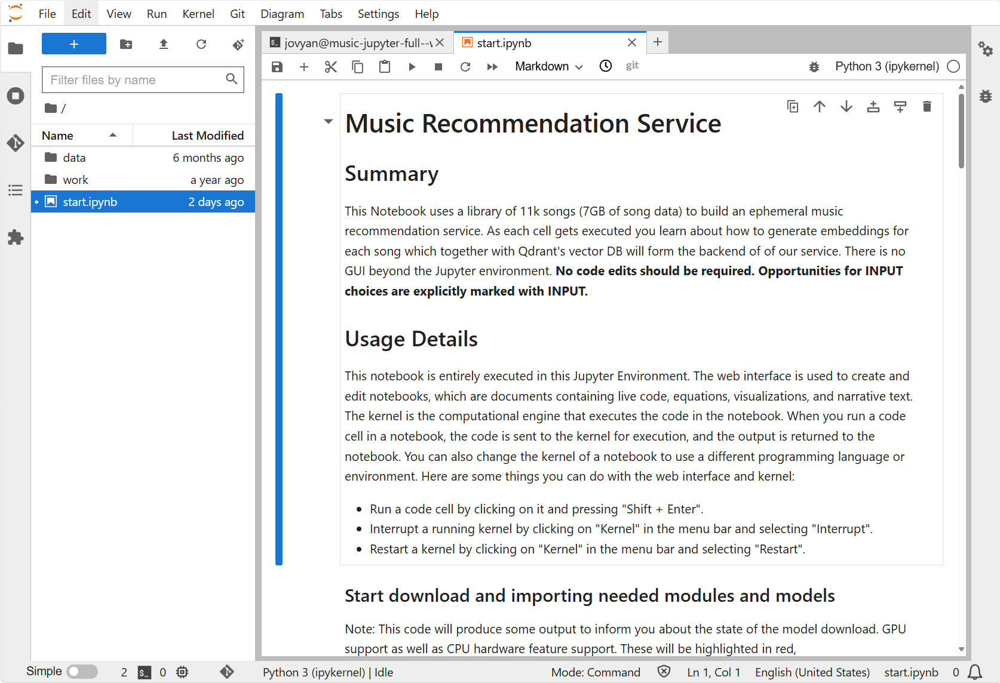

# Music Recommendation Jupyter Notebook



## Overview
Using the notebook the user learns about how the Qdrant vector database can be used to generate music recommendations. The notebook server is based on [Jupyter Docker Stacks](https://jupyter-docker-stacks.readthedocs.io/en/latest/) and uses the [Ludwig Music Dataset](https://www.kaggle.com/datasets/jorgeruizdev/ludwig-music-dataset-moods-and-subgenres) from Kaggle. We use the [panns-inference](https://pypi.org/project/panns-inference/) package to generate embeddings of our audio. Detailed documentation is provided in-notebook.

> The original version of this notebook can be found here: 
> [https://github.com/qdrant/examples/blob/master/qdrant_101_audio_data/03_qdrant_101_audio.ipynb](https://github.com/qdrant/examples/blob/master/qdrant_101_audio_data/03_qdrant_101_audio.ipynb).


## Data Prep
The original version of this notebook shapes the original Kaggle dataset into a format which is more suited for vector database insertion. Only then does it cover the embedding generation and recommendation retrieval. 

Skipping the dataset shaping is recommended. Since it adds little to the overall learning simply starting with the ready-to-go container (`simonj.azurecr.io/aca-ephemeral-music-recommendation-image`) speeds things up. The container contains the data in the correct shape, and stores it for easy ingestion as part of the notebook (arrow format).

If you want to re-shape the data from the original Kaggle data you can do so using the `data_prep.ipynb` notebook included as part of the container.


## Important
Please keep the following in mind as you use this notebook:
* All of the Jupyter notebook data is ephemeral and hence **the changes you make to the 
  notebook will not be preserved**. If you'd like to customize the notebook and reuse it
  you can use the File > Download menu to do so.
* The provided dataset is ~11k songs. A regular workstation CPU generates around 1k embeddings
  in ~120 minutes.
* The Jupyter container includes the data needed for our tutorial, due to its size startup
  will take longer than usual.


## Run
To run this notebook locally it is recommended that you run this notebook on a CUDA enabled workstation which also uses the [NVIDIA Container Toolkit](https://docs.nvidia.com/datacenter/cloud-native/container-toolkit/latest/install-guide.html). The command below assumes you're using the pre-build Docker image.
```
docker run \
  --gpus all \
  -it -p 8888:8888 \
  -e RESTARTABLE=yes \
  simonj.azurecr.io/aca-ephemeral-music-recommendation-image
```
As the container starts you should see a login URL which shows the login token. Accessing [http://localhost:8888](http://localhost:8888) should give you access to the web UI.


## Todo
* Make the embeddings data available